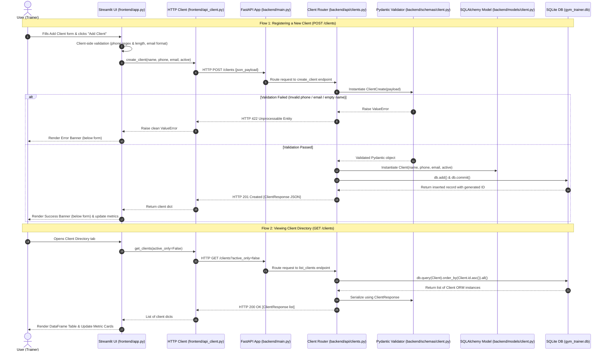

# Technical Documentation Report: Client Management Module

**Project:** Gym Trainer Management System (IB CS IA)
**Module:** Client APIs & Streamlit Frontend UI Integration
**Date:** September 19, 2026

---

## 1. Executive Summary

This report documents the design, architecture, validation logic, and end-to-end data flow for the **Client Management Module**. This module connects a **Streamlit** multi-tab frontend interface with a **FastAPI** RESTful backend operating over an **SQLite** database (`gym_trainer.db`).

The module supports two core client business workflows:

1. **Fetching Client Roster (`GET /clients`)**: Displays all registered clients with optional active status filtering and real-time name searching.
2. **Registering a Client (`POST /clients`)**: Validates input data (strict 10-digit phone validation, email format checking, non-empty name validation) and persists new client records in SQLite.

---

## 2. End-to-End System Architecture & Data Flow



---

## 3. Implemented File Matrix

| File Path                     | Component           | Responsibility & Changes Implemented                                                                                                                           |
| ----------------------------- | ------------------- | -------------------------------------------------------------------------------------------------------------------------------------------------------------- |
| `backend/database.py`       | Database Engine     | Configured SQLAlchemy SQLite engine, session factory (`SessionLocal`), and FastAPI `get_db()` yield dependency.                                            |
| `backend/models/client.py`  | ORM Model           | Defined`Client` SQLAlchemy model mapped to `clients` table columns (`id`, `name`, `phone`, `email`, `active`, `created_at`, `updated_at`).   |
| `backend/schemas/client.py` | Pydantic Schemas    | Implemented`ClientBase`, `ClientCreate`, and `ClientResponse` Pydantic v2 schemas with strict field validators.                                          |
| `backend/api/clients.py`    | API Router          | Implemented`GET /clients` (with `?active_only` filtering) and `POST /clients` with `try...except db.rollback()` error safety.                          |
| `backend/main.py`           | FastAPI Application | Configured FastAPI app, CORS middleware, and`/health` health-check endpoint.                                                                                 |
| `frontend/api_client.py`    | HTTP Helper         | Implemented`check_health()`, `get_clients()`, and `create_client()` functions using `requests` with clean error detail parsing.                        |
| `frontend/app.py`           | Streamlit UI        | Primary multi-tab UI page containing health status badge, client roster table, search filter, metric cards, and client registration form with banner feedback. |
| `database/schema.sql`       | SQL DDL Script      | SQLite table definitions for`clients`, `sessions`, and `payments` tables with `created_at` and `updated_at` timestamps.                              |
| `database/seed.sql`         | SQL Seed Script     | Seed data containing 20 clients, 77 workout sessions (scheduled, completed, cancelled, compensation), and 40 payment records.                                  |

---

## 4. Key Design Decisions & Validation Logic

### A. Pydantic Schema Separation (`ClientCreate` vs. `ClientResponse`)

- **Problem**: Placing strict validation on `ClientBase` caused FastAPI's `serialize_response` step to raise a `ResponseValidationError` (HTTP 500) whenever `GET /clients` fetched legacy/seeded database records with country codes (e.g. `+91-98765-43210`).
- **Solution**:
  - **`ClientCreate`**: Inherits from `ClientBase` and enforces `@field_validator` checks exclusively during **new record creation**:
    - **Name Validator**: Rejects empty strings or whitespace-only names.
    - **Phone Validator**: Uses regex `^\+?[0-9\s\-()]{7,15}$` to reject letters/alphabets (e.g., `78w91w19`). Strips country code prefixes (`+91`, `+1`, `+44`) and verifies that the core number is **exactly 10 digits**.
    - **Email Validator**: Uses regex `^[a-zA-Z0-9_.+-]+@[a-zA-Z0-9-]+\.[a-zA-Z0-9-.]+$` to verify standard email format.
  - **`ClientResponse`**: Inherits from `ClientBase` without input creation validation rules, allowing existing database rows to serialize cleanly to JSON.

### B. Database Transaction Safety & Sequence Management

- **Transaction Rollbacks**: In `backend/api/clients.py`, `POST /clients` is wrapped in a `try...except` block with `db.rollback()` to prevent orphaned database states on commit errors.
- **Auto-Increment Sequence Management**: SQLite tracks auto-increment sequence values in `sqlite_sequence`. When test entries are removed, executing `UPDATE sqlite_sequence SET seq = 20 WHERE name = 'clients'` ensures newly created clients receive contiguous ID numbers starting at **#21** without ID gaps.

### C. Frontend Layout & User Feedback Placement

- **Validation Error Banner**: Positioned directly below the **Add Client** form submit button in **Tab 2** to provide immediate inline feedback (`❌ Invalid Field: Phone number must contain valid digits only...`).
- **Success Banner**: Renders directly below the **Add Client** submit button (`🎉 Success! Client 'John Doe' (ID: #21) was successfully added!`).
- **Streamlit Compatibility**: Used `width="stretch"` for `st.dataframe()` to ensure long-term compatibility past Streamlit's 2025 deprecation of `use_container_width`.

---

## 5. Summary of API Endpoints

```http
### 1. Health Check
GET /health
Response 200 OK:
{
  "status": "healthy",
  "service": "Gym Trainer API"
}

### 2. List Clients
GET /clients?active_only=false
Response 200 OK:
[
  {
    "id": 1,
    "name": "Alex Johnson",
    "phone": "5550101",
    "email": "alex.j@example.com",
    "active": true,
    "created_at": "2026-08-01T09:00:00",
    "updated_at": "2026-08-01T09:00:00"
  }
]

### 3. Create Client
POST /clients
Content-Type: application/json
{
  "name": "Nandani Mishra",
  "phone": "8928376353",
  "email": "nandani@gmail.com",
  "active": true
}

Response 201 Created:
{
  "id": 21,
  "name": "Nandani Mishra",
  "phone": "8928376353",
  "email": "nandani@gmail.com",
  "active": true,
  "created_at": "2026-09-19T18:40:00",
  "updated_at": "2026-09-19T18:40:00"
}
```
